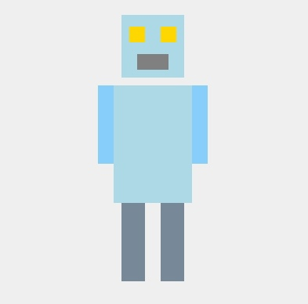

**Задача:** собрать из прямоугольных элементов некую узнаваемую фигуру в поле экрана (робота), использовав различные варианты якорной привязки.
Все элементы определены как компонент.

**Демонстрация:**

